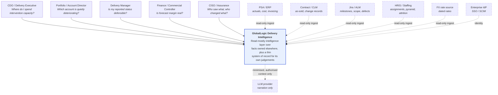
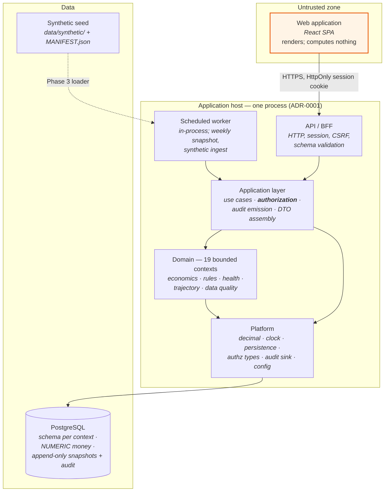
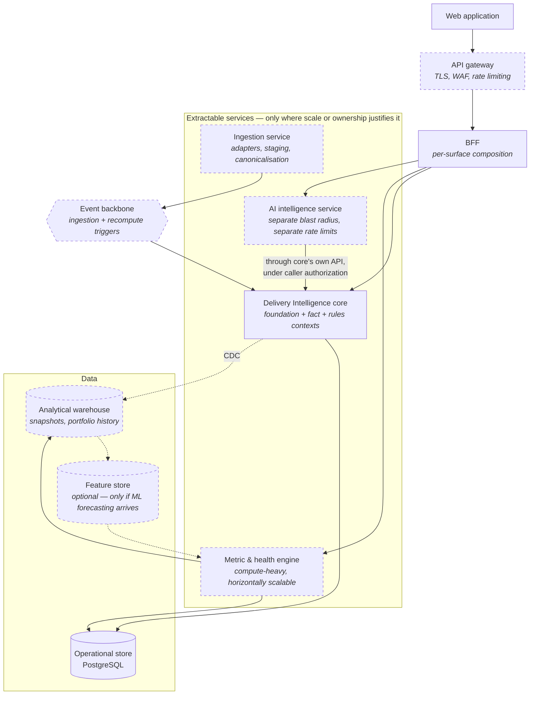
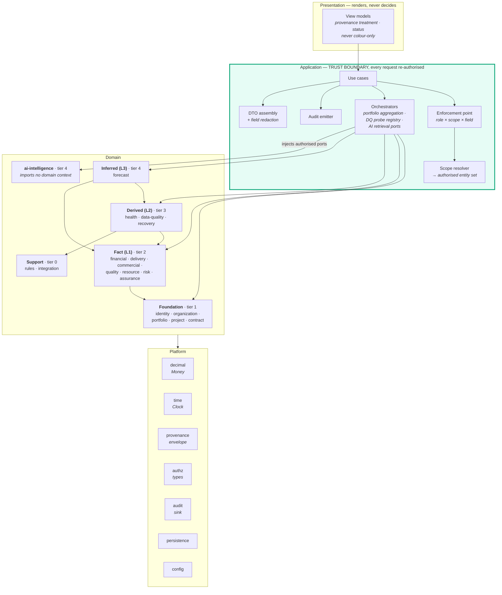

# C4 architecture views

**DEMO — SYNTHETIC DATA** · Phase 1 · Governed by ADR-0001

Three levels: system context, containers, components. A fourth (code) is not drawn — the module map
and the enforced manifest serve that purpose better than a diagram that would be stale within a
phase.

Each diagram is drawn **twice where POC and target differ**, because the single most common way an
architecture document misleads is by drawing the aspiration and letting the reader assume it is
built.

---

## 1. System context

Who and what the system talks to.

**Dashed = not connected in the POC.** Every external system above is represented in the POC by the
synthetic loader behind the `integration` adapter seam (`PRODUCT_SPEC.md` §4.2). The LLM provider is
introduced in Phase 11 and only then.

Two directional facts the diagram is making load-bearing:

- **Every source arrow points inward.** The product does not write back to source systems
  (`PRODUCT_SPEC.md` §1.3). It is not a PSA, an ERP, a timesheet system, or a PM tool.
- **The browser never appears beside a source system.** There is no path from a user's browser to an
  enterprise source; all ingestion is server-side. This is a security constraint, not a performance
  one.

---

## 2. Containers

### 2.1 POC — what actually runs

The single most important property of this picture is what is **absent**: no message broker, no
cache tier, no second datastore, no per-context service (ADR-0001 §Decision 7). One process and one
transaction boundary is why the margin bridge reconciles.

`JOB` runs in-process rather than as a separate container. It is drawn separately because it is the
first thing that becomes its own container at scale, not because it is one now.

### 2.2 Target state — where the seams lead

**The seams are chosen deliberately, and there are only four.** Each corresponds to a real reason to
separate — compute profile, blast radius, ownership, or ingest cadence — not to a context boundary.
Nineteen contexts do not become nineteen services (ADR-0001 §Alternatives).

| Seam | Why it is a plausible service later | Why it is not one now |
| --- | --- | --- |
| Ingestion | Different cadence, different failure modes, different scaling from query traffic | One synthetic loader, no live sources |
| Metric & health engine | CPU-bound; scales with projects × weeks, not with users | 48 projects × 78 weeks computes in milliseconds |
| AI intelligence | Different blast radius, different rate limits, external provider dependency | Already isolated *architecturally* by the import ban — the wall exists without the process |
| BFF | Per-surface composition may want independent deploy cadence from the domain | One surface family, one team |

The AI arrow in the target diagram is the same arrow as in the POC: it reaches data only through the
core's application services, under the caller's authorization. That property must survive extraction
or ADR-0004's guarantee is lost.

---

## 3. Components — inside the application host

Read the arrows into `ai-intelligence` carefully: they point **from** the orchestrator **into** the
context, not the other way. The assistant does not fetch; it is handed a port that was already
bound to the caller's authorization context. That inversion is what makes AC-6 a test rather than a
promise, and it is enforced as violation `ARCH-004`.

Three components deserve naming because the brief names them as distinct concepts and conflating
them is a common failure:

| Concept | Where it lives | What it must never do |
| --- | --- | --- |
| **ProjectEconomicsEngine** | `financial` context | Be reimplemented in a chart, a SQL view, or the assistant |
| **Rules engine** | `rules` context (definitions) evaluated by consumers | Hold thresholds as code constants |
| **Health engine** | `health` context | Run in the UI (REQ-HLTH-008), or absorb confidence into its score |
| **Trajectory engine** | `forecast` context | Be presented with the authority of a computed margin figure |
