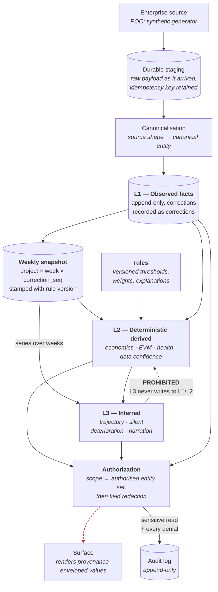
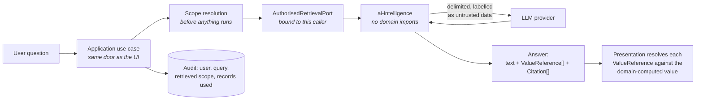
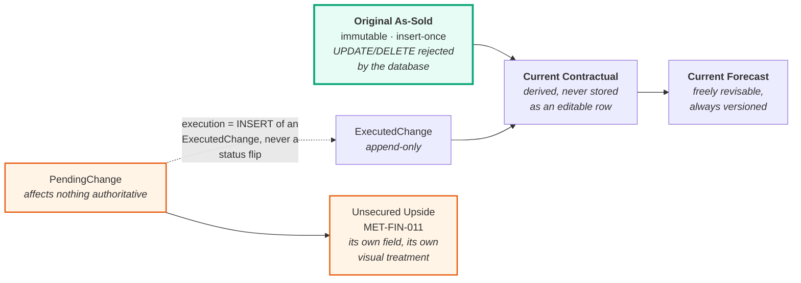

# Data flow — from a recorded fact to a defensible number

**DEMO — SYNTHETIC DATA** · Phase 1 · Governed by ADR-0003, ADR-0004, ADR-0005

---

## 1. The main path



Four properties of this diagram are the product:

1. **Nothing skips the enforcement box.** There is no path from any layer to a surface that does not
   pass authorization. The assistant is not an exception; it enters at the same box (§3).
2. **The red arrow does not exist in code and cannot be added.** `financial` cannot import `health`
   (`ARCH-003`); `health` cannot import `forecast` (`ARCH-003`); nothing at all may import
   `ai-intelligence`. Contamination of facts by inference is a build failure.
3. **Trajectory reads the snapshot series, not current state** (ADR-0003 §4). This is why a
   deterioration claim can always name the weeks that produced it.
4. **The rule version enters at L2 and travels with the value.** That is what makes "why did this
   project show Amber in June?" answerable in Phase 12.

---

## 2. What travels: the provenance envelope

Every value crossing the Application boundary is wrapped (ADR-0004 §1):

```ts
{ value, layer: 'L1' | 'L2' | 'L3', sources: RecordRef[], ruleVersion?, computedAt, confidence? }
```

The constructors refuse the envelopes that would violate the layering:

| Constructor | Refuses | Requirement |
| --- | --- | --- |
| `observed(value, source, at)` | — | L1 always names the record it came from |
| `derived(value, sources, ruleVersion, at)` | empty `sources` | REQ-DATA-010 — lineage is mandatory |
| `inferred(value, sources, at, ruleVersion?)` | empty `sources` | REQ-AI-002 — an inference with no citable evidence may not be produced at all |

`inferred` accepting an optional rule version is deliberate. `forecast` produces deterministic,
rule-based judgements that are still *inferences* (ADR-0004 §Consequences). Determinism and
epistemic layer are independent.

### 2.1 Evidence chain (AC-3)

`sources` is what makes "drill any headline number to its facts in ≤3 steps" structural rather than
a screen someone remembered to build:

```
MET-HLTH-010 composite 68  (L2, HEALTH-v1)
  └─ MET-HLTH-001 financial dimension 54  (L2, HEALTH-v1)
       └─ MET-FIN-014 forecast margin 11.4%  (L2)
            ├─ MET-FIN-010 forecast revenue  (L2) ─ contract:AsSoldBaseline + ExecutedChange×3
            └─ MET-FIN-008 EAC cost          (L2) ─ financial:ActualCost×47 + Etc
```

Three hops, each a `RecordRef`, each resolvable to a view. No screen invents this; it walks the
envelope.

---

## 3. The assistant path



Three controls are structural rather than prompt-based:

- **Scope is resolved before the model runs.** A fully successful prompt injection cannot widen it,
  because there is nothing left to widen — the retrieval port was already bound
  (`SECURITY_MODEL.md` §6).
- **Retrieved record text is `untrusted: true` in the type.** Assembling a prompt from it without
  delimiting it is a visible omission (`SECURITY_MODEL.md` §2 B4).
- **The model emits references, never numerals** (ADR-0004 §4). `ValueReference` has no `value`
  field. A wrong number is not expressible, so transcription error stops being a category of defect.

---

## 4. Temporal flow — three baselines and two questions



`PendingChange → Forecast` is **not drawn because it must not exist** (REQ-FIN-005). A pending change
reaches the screen only as Unsecured Upside, and the type system helps: `ContractService` returns
pending changes from a separate method that no forecast path calls.

**As-of vs as-corrected.** A correction is a new snapshot row carrying a `corrects` reference, never
an update. So both questions stay answerable:

| Question | Reads |
| --- | --- |
| "What did we believe on 2026-04-15?" | that week's snapshot as originally written |
| "What do we *now* believe was true on 2026-04-15?" | that week's latest correction |

Conflating them would destroy the divergence signal — what we believed *then* versus what turned out
to be true is precisely the evidence that a project was deteriorating unnoticed.

---

## 5. Where each requirement's data lives

| Flow stage | Owning module | Requirements |
| --- | --- | --- |
| Source → staging | `integration` | REQ-DQ-004 (freshness), ADR-0008 (proposed) |
| Staging → canonical L1 | `integration` → fact contexts | REQ-DATA-001 |
| L1 → weekly snapshot | fact contexts + scheduled worker | REQ-DATA-005, REQ-DATA-010 |
| Snapshot + rules → L2 | `financial`, `delivery`, `health`, `data-quality` | REQ-FIN-002/003, REQ-HLTH-001…006, REQ-DQ-001 |
| Snapshot series → L3 | `forecast` | REQ-HLTH-004 |
| L1/L2 → L3 narration | `ai-intelligence` via ports | REQ-AI-001…006 |
| Any → surface | Application layer | REQ-SEC-002…006, REQ-UX-004 |
