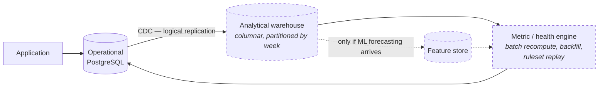

# Data platform — operational, analytical, and scale

**DEMO — SYNTHETIC DATA** · Phase 1 · **Proposed as ADR-0007 — not implemented**

---

## 1. POC: one PostgreSQL, doing both jobs

ADR-0001 §Decision 1 fixes this: one deployable process, one primary transactional database. At POC
volume the operational and analytical workloads are the same workload.

```
PostgreSQL
├── identity.*        ┐
├── organization.*    │  schema per bounded context
├── contract.*        │  no cross-schema foreign keys
├── financial.*       │  no cross-schema joins
├── delivery.*        │  contexts reference each other by opaque id
├── …                 │
└── audit.*           ┘  separate role, no UPDATE/DELETE grant
```

### 1.1 Schema strategy

| Rule | Mechanism | Authority |
| --- | --- | --- |
| One schema per context | Migration per context, namespaced | ADR-0001 §3 |
| No cross-context foreign keys | Reviewed at migration; **Phase 2 adds the automated check** (debt DR-007) | ADR-0001 §3 |
| No cross-context joins | Access goes through the owning context's service | ADR-0001 §3 |
| Money is `NUMERIC(18,4)` with an adjacent currency column | Exact at rest, exact in the domain | ADR-0002 §Impact |
| Rates and ratios are `NUMERIC(12,6)` | Sub-minor-unit precision for blended rates and escalations | ADR-0002 §Alternatives |
| As-Sold rows reject `UPDATE`/`DELETE` | Revoked privilege **and** a rejecting trigger — two controls, because one can be granted back by accident | ADR-0003 §Impact, REQ-DATA-003 |
| Snapshots keyed `(project, week, correction_seq)` | Corrections append; nothing overwrites | ADR-0003 §3 |
| Audit table rejects `UPDATE`/`DELETE` for the application role | Append-only is a privilege, not a promise | `SECURITY_MODEL.md` §5.3 |

**Why no cross-context foreign keys.** They are the mechanism by which a modular monolith quietly
becomes an unsplittable one: the database enforces a coupling the code has agreed not to have, and
the first extraction attempt discovers it. Referential integrity *within* a context is kept and
valued; across contexts, consistency is the owning service's job.

### 1.2 Migrations

Forward-only, ordered, one file per change, each naming its context and the ADR or requirement that
motivated it. A `down` exists for local development only; production rollback is roll-forward. The
POC has no data to migrate — this matters from Phase 3, when the synthetic portfolio exists and a
schema change means a regeneration and a new content hash.

---

## 2. Read models and the DQ-1 question

`DQ-1` (read-model vs compute-on-read for portfolio rollups) is **deliberately open until Phase 4**
(`ARCHITECTURE_DECISIONS.md` §6). Deciding it now would be guessing at query shapes that do not
exist yet. What Phase 1 does is make either answer cheap:

- Aggregation is a **pure function over supplied inputs** (`PortfolioAggregationInput[]`), so its
  inputs can come from a live query today and a materialised projection later without the
  aggregation itself changing.
- Snapshots are already the natural materialisation unit. A `portfolio_week_rollup` projection, if
  Phase 4 wants one, is derived from snapshot rows that already exist and are already immutable.

The constraint that survives either answer: **a projection must be recomputable from L1 + rule
version.** A read model that cannot be rebuilt is a second system of record.

---

## 3. Target state: splitting operational from analytical

The workloads diverge along a clean line, which is why this split does not require rewriting domain
contracts:

| | Operational | Analytical |
| --- | --- | --- |
| Question | "What is true about project X now?" | "How has the portfolio moved over 18 months?" |
| Access | Point reads, small writes, transactional | Wide scans over projects × weeks |
| Latency | Interactive | Seconds acceptable |
| Data | Current + recent snapshots | Full snapshot history, denormalised |
| Store | PostgreSQL (unchanged) | Columnar warehouse |
| Fed by | Application writes | **CDC from the operational store** |



**The domain contracts do not change**, and that is the point of the acceptance gate. Contexts
depend on `Repository`, `AppendOnlyStore` and `UnitOfWork` — not on SQL, not on a connection, not on
a schema. Moving history to a warehouse changes which adapter implements `AppendOnlyStore.seriesAsOf`
and nothing above it. A context that had been allowed to write raw cross-schema SQL would make this a
rewrite; that is why ADR-0001 §7 restricts it.

**The feature store is conditional, not planned.** `PRODUCT_SPEC.md` §4.2 defers ML forecasting
explicitly, and Phase 11 is deterministic rules plus LLM narration. A feature store with no model to
serve is infrastructure with no consumer. It is drawn so the path is visible, dashed so nobody
schedules it.

---

## 4. Global scale

The gate question is "can 48 synthetic projects grow to thousands?" — the number is
`SYNTHETIC_DATA_SPEC.md` §3's, see **CONFLICT C-3**.

### 4.1 The volume arithmetic

| Dimension | POC | Global target | Ratio |
| --- | --- | --- | --- |
| Projects | 48 | 5,000 | ×104 |
| Weekly snapshots retained | 78 (18 months) | 260 (5 years) | ×3.3 |
| Snapshot rows | ~3.7 k | ~1.3 M | ×350 |
| L2 metric values per snapshot | ~100 | ~100 | — |
| Derived values | ~370 k | ~130 M | ×350 |
| Concurrent users | ~10 | ~2,000 | ×200 |

130 M narrow rows is not a large table. It is, however, comfortably past the point where a portfolio
view can compute on read across the whole history, which is what makes DQ-1 a Phase 4 decision
rather than a permanent non-issue.

### 4.2 What each scale dimension requires

| Dimension | Design response | Present in Phase 1? |
| --- | --- | --- |
| **Thousands of projects** | Aggregation over a supplied, pre-scoped input set; ranking server-side; pagination on every collection endpoint | Contract shape yes; pagination is a Phase 7 obligation |
| **Years of snapshots** | Weekly (not daily) granularity; partition by week; trajectory reads a bounded trailing window (8 weeks per MET-FCST-001), not full history | Yes — the window is in the `Trajectory` contract |
| **Organisation hierarchy** | `organization` owns an arbitrary-depth tree; scope resolves to a concrete entity set once per request and is reused | Yes — `AuthorisedEntitySet` |
| **Multi-currency** | Every amount carries its currency; aggregation across currencies requires an explicit dated FX rate and records it | Yes — `Money` throws on mixed-currency arithmetic |
| **Fiscal calendars** | Period arithmetic is a platform concern, injected, not hard-coded to calendar quarters | **Deliberately stubbed** — OQ-5 is open |
| **Regional policy** | `PERSONAL_DATA` classification separate from commercial; residency is a deployment-topology question, not a domain one | Classification yes; residency deferred |
| **Concurrent users** | Read-mostly; the expensive work is recompute, which is batch and cacheable per (project, week, ruleVersion) | Cache key shape yes; no cache tier (ADR-0001) |

### 4.3 The property that makes recompute cheap

`(project, week, ruleVersion) → derived values` is a **pure function**. That is not a performance
observation dressed up as an architecture one; it is why:

- results are cacheable with a key that is correct by construction — a rule change changes the key,
  so stale results cannot be served;
- recompute parallelises across projects with no coordination;
- Phase 12 can replay a historical assessment and get the same answer (AC-7).

An engine that read ambient time or mutated shared state would forfeit all three. Hence the injected
`Clock` and the immutable `Money`.

---

## 5. What Phase 1 does not build

No schema, no migration, no query, no database connection. Phase 2 owns the canonical model
(REQ-DATA-001…006) and Phase 5 the immutability enforcement. What exists is the set of persistence
contracts in `src/platform/persistence`, shaped so that ADR-0003's guarantees are expressible in
types before they are expressible in DDL.
