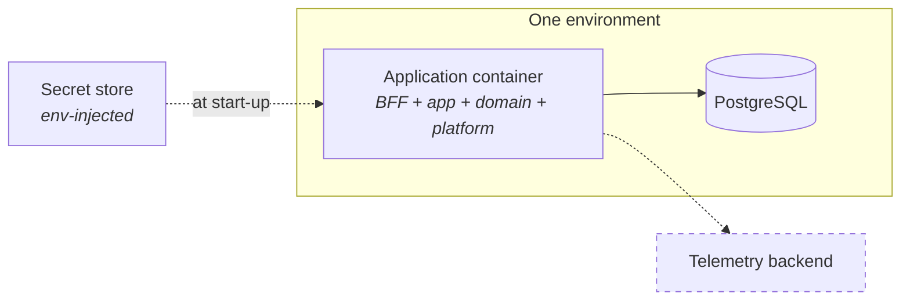

# Deployment, environments, and configuration

**DEMO — SYNTHETIC DATA** · Phase 1 · **Proposed as ADR-0010 — not implemented**

---

## 1. Environments

| Env | Purpose | Data | Identity | Assistant |
| --- | --- | --- | --- | --- |
| `dev` | Local development | Synthetic, regenerable | Seeded demo users | Stubbed or live, developer's choice |
| `test` | Automated suites | Synthetic, fixed seed, fresh per run | Fixtures | Stubbed — deterministic tests never call a model |
| `staging` | Demo rehearsal, adversarial review (Phase 12) | Synthetic, same seed as prod demo | Seeded demo users | Live |
| `prod` | The demo as shown | Synthetic — **there is no real data** | Seeded demo users | Live |

`prod` holding synthetic data is a POC property, not a stage in a migration. `CLAUDE.md`: this
repository "must never be pointed at production systems."

**Every environment runs the same artefact.** Configuration differs; the build does not. A build that
behaves differently because of an environment check is a build whose staging results do not
transfer — and `SECURITY_MODEL.md` §2 B6 already forbids the specific case that matters: "If [a
development bypass] is needed for development, it must not exist in the demo build."

---

## 2. Topology

One container image, one database. Scheduled work (weekly snapshot, ingestion) runs in-process in
the POC; the seam to extract it is a separate entrypoint on the same image, not a separate codebase.

The gate question — can this scale? — is answered by horizontal replicas of a stateless application
container in front of one database, with recompute moving to its own replica set when
`recompute.duration` says it should. Nothing in the domain contracts assumes a single instance,
because nothing in the domain holds mutable process state: the `Clock` is injected, `Money` is
immutable, and derived values are pure functions of `(project, week, ruleVersion)`.

---

## 3. Configuration and secrets

| Rule | Mechanism |
| --- | --- |
| No secret in the repository (REQ-SEC-008) | `.env` git-ignored; `.env.example` documents keys with **no values**; secret scan in CI |
| Configuration is environment-injected | `loadConfig(process.env)` at the composition root only |
| Nothing below the composition root reads the environment | Architecture gate: node builtins are confined to the platform layer (`ARCH-006`) |
| Invalid configuration fails at start-up | `loadConfig` throws `ConfigError`; no dangerous default |
| Secrets never reach a log, a span, or a serialised value | `SECURITY_MODEL.md` §7 |

The POC has no secrets today — no external provider, no SSO. The controls exist before the secret
does, which is the only order in which that works.

---

## 4. Infrastructure as code — readiness, not implementation

Not written in the POC. What is done now so it is not retrofitted:

1. **The application is configuration-driven**, so an IaC-provisioned environment differs only in
   injected values.
2. **No manual step exists between build and run.** REQ-OPS-003 requires the demo to execute
   end-to-end reproducibly from a clean environment; a manual step would be discovered in Phase 12,
   which is the worst possible time.
3. **Migrations are ordered, forward-only files**, so environment provisioning is deterministic.
4. **The container is the deployment unit**, so the IaC surface is "run this image with this
   configuration against this database" — small enough to write later without redesign.

---

## 5. The browser is never coupled to an enterprise source

Stated as an architectural constraint because it is one of the easier corners to cut and one of the
harder to un-cut:

- No client-side call to a PSA, ERP, ALM or HRIS. All ingestion is server-side.
- No source credential ever reaches the browser.
- No CORS grant from a source system to the SPA.
- The SPA's only origin is the BFF.

This is why the system context diagram has no arrow from the browser to any source system, and why
`integration` sits at tier 0 in the domain rather than anywhere near presentation.

---

## 6. What Phase 1 does not build

No container image, no compose file, no IaC, no deployment pipeline beyond CI. ADR-0010 is
`Proposed`. `src/platform/config` exists and is tested, so the configuration contract is settled
before anything depends on it.
