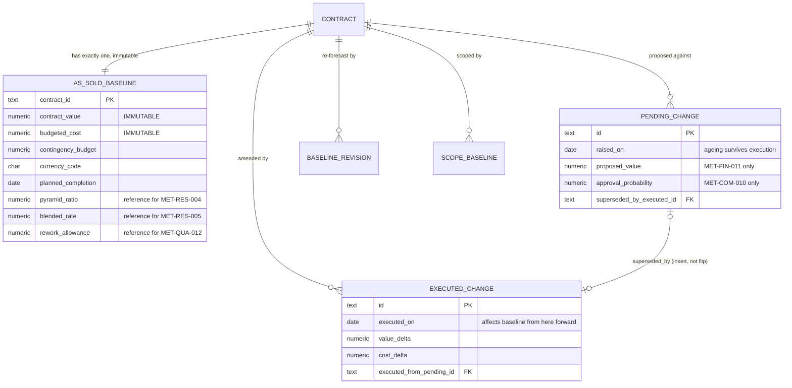
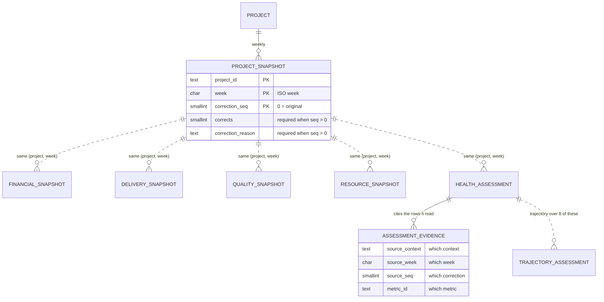

# Canonical domain model

**DEMO — SYNTHETIC DATA** · Phase 2 · Governed by ADR-0001, ADR-0002, ADR-0003, ADR-0004

Entity-relationship view of the canonical model. Relationships **within** a context are foreign
keys; relationships **across** contexts are opaque identifiers, never foreign keys
(ADR-0001 §Decision 3) — drawn dashed below and enforced by
`scripts/ci/check-schema-boundaries.mjs`.

---

## 1. The temporal core — three baselines

This is the part of the model that carries the product's anti-laundering guarantee, so it is drawn
first and on its own.

Three properties the diagram is asserting:

- **`AS_SOLD_BASELINE` has no update path.** Insert-once, with a revoked privilege *and* a rejecting
  trigger (`migrations/0004`). There is no "corrected" column, because a correction to an as-sold
  baseline is a restatement, and restatement is what makes variance meaningless.
- **`PENDING_CHANGE` has no status column.** Deliberately. A status column is the one-statement
  route to moving unsecured revenue into the forecast (REQ-FIN-005). Execution inserts an
  `EXECUTED_CHANGE` and back-references the pending row, so the duration it sat unexecuted survives
  as evidence (`MET-COM-007`).
- **Current Contractual Baseline is not a table.** It is derived, in one place, as As-Sold plus
  executed changes with `executed_on ≤ t`.

---

## 2. The snapshot spine

Every domain snapshot hangs off the same weekly key, so "as of week W" means the same thing in
every context.

`(project_id, week, correction_seq)` is the primary key everywhere. A correction is a new row with
a higher sequence that must name what it corrects — enforced by a `CHECK` constraint, not by
convention. That is what keeps both temporal questions answerable:

| Question | Read |
| --- | --- |
| What did we believe on 2026-04-15? | `correction_seq = 0` for that week |
| What do we *now* believe was true then? | highest `correction_seq` for that week |

`ASSESSMENT_EVIDENCE` is the lineage table (REQ-DATA-010). It is what makes AC-3 answerable months
later, after the underlying snapshot has been corrected: the assessment cites the rows it actually
read, not the rows that exist now.

---

## 3. Whole model, by context

```mermaid
erDiagram
    ORGANIZATION_NODE ||--o{ ORGANIZATION_NODE : "parent of"
    ORGANIZATION_NODE ||--o{ REGION : "contains"
    ORGANIZATION_NODE ||--o| FISCAL_CALENDAR : "reports on"
    CUSTOMER ||--o{ ACCOUNT : "held as"
    CUSTOMER }o--|| INDUSTRY : "classified"
    CUSTOMER }o--|| REGION : "located"

    PORTFOLIO ||--o{ PROGRAM : "contains"
    PORTFOLIO ||--o{ MEMBERSHIP : "groups"

    PROJECT ||..|| CONTRACT : "contract_id (opaque)"
    PROJECT ||..|| ACCOUNT : "account_id (opaque)"
    PROJECT ||..|| PORTFOLIO : "portfolio_id (opaque)"

    ACTUAL_COST }o..|| PROJECT : "project_id (opaque)"
    ETC_LINE_ITEM }o..|| PROJECT : "project_id (opaque)"
    COMMITMENT }o..|| PROJECT : "project_id (opaque)"
    CONTINGENCY_DRAWDOWN }o..|| PROJECT : "project_id (opaque)"

    MILESTONE }o..|| PROJECT : "project_id (opaque)"
    SCOPE_ITEM }o..|| PROJECT : "project_id (opaque)"
    PROGRESS_CLAIM }o..|| PROJECT : "project_id (opaque)"
    DEPENDENCY }o..|| PROJECT : "project_id (opaque)"

    DEFECT }o..|| PROJECT : "project_id (opaque)"
    ACCEPTANCE_ITEM }o..|| PROJECT : "project_id (opaque)"
    ASSIGNMENT ||--o{ EFFORT_RECORD : "books"
    RISK ||--o{ MITIGATION : "mitigated by"

    RULE_DEFINITION ||--o{ RULE_PARAMETER : "parameterised by"
    METRIC_DEFINITION ||--o{ METRIC_VERSION : "versioned by"

    APP_USER ||--o{ SCOPE_GRANT : "scoped by"
    APP_USER ||--o{ SESSION : "authenticates"
    REVIEW ||--o{ FINDING : "raises"
```

Solid lines are foreign keys inside one schema. Dashed lines are opaque identifiers across schemas —
the coupling the code has agreed not to have, and which the database is deliberately not allowed to
enforce, so the monolith stays splittable (ADR-0007 §Rationale).

---

## 4. Layer assignment (ADR-0004)

| Layer | Entities | Count of metrics |
| --- | --- | --- |
| **L1 Observed Fact** | `ActualCost`, `EtcLineItem`, `Commitment`, `ContingencyDrawdown`, `ProgressClaim`, `Milestone`, `Defect`, `AcceptanceItem`, `EffortRecord`, `Risk`, `StatusReport`, `Invoice`, `Payment`, `Dependency` | 16 |
| **L2 Deterministic Derived** | `FinancialSnapshot`, `DeliverySnapshot`, `QualitySnapshot`, `ResourceSnapshot`, `RiskSnapshot`, `HealthAssessment`, `DataQualityAssessment`, `PortfolioRollup` | 112 |
| **L3 Inferred** | `TrajectoryAssessment`, `EarlyWarning`, `RecoveryScenario`, assistant answers | 9 |

The direction is enforced structurally: an L1 table has no column that references a derived value,
and `metric-registry.test.ts` asserts that no L1 metric depends on a derived metric — a fact does
not know its own score.

---

## 5. Where the four Phase 2 metric families land

The Phase 2 brief named four families that had no home in the Phase 0 catalog. All four are now
modelled, and each resolves a previously-open catalog item:

| Family | Entities added | Metrics | Resolves |
| --- | --- | --- | --- |
| Contingency | `ContingencyDrawdown`, `AsSoldBaseline.contingencyBudget` | MET-FIN-034/035/036/037 | **MC-9** |
| Physical progress | `ProgressClaim` | MET-DEL-015/016/017 | **MC-10** |
| Risk-adjusted economics | `Risk.includedInEtc`, `PendingChange.approvalProbability` | MET-FIN-019/031/032/033, MET-RSK-008, MET-COM-010 | **MC-11**, **MC-4** |
| Acceptance | `AcceptanceItem` | MET-QUA-010/011 | **MC-12** |

`Risk.includedInEtc` is the field worth pausing on. It carries a mandatory justification when true
(a `CHECK` constraint, not a convention) because it is what prevents the same risk being provisioned
inside ETC *and* deducted from margin — a double count that systematically understates the whole
portfolio.
