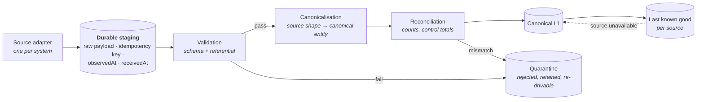

# Integration model

**DEMO — SYNTHETIC DATA** · Phase 1 · **Proposed as ADR-0008 — not implemented**

The POC has exactly one source: the synthetic generator (Phase 3). Everything here is the seam that
source arrives through, designed so a real PSA adapter is an implementation rather than a
restructuring.

---

## 1. Pipeline



**Staging is durable and holds the payload as it arrived.** The reason is not resilience but
forensics: when a margin figure is disputed, "what did the source actually send us on 12 June?" must
be answerable without asking the source system, which by then has moved on. Canonicalisation is
lossy by design; staging is where the loss is recoverable from.

---

## 2. Ingestion modes

| Mode | When | Sources | POC |
| --- | --- | --- | --- |
| **Batch / scheduled** | Data changes on a cadence slower than we read it | PSA actuals (nightly), HRIS (weekly), FX (daily) | Synthetic loader runs once |
| **Event-driven** | The source can push and latency matters | CLM change execution, milestone completion | Contract declared; no broker (ADR-0001) |
| **CDC** | High-volume, source cannot push, we need change granularity | Large PSA/ERP transaction tables | Readiness only — §4 |
| **Manual/API** | The product's own judgements | Overrides, interventions, reported RAG | Phase 5/10, direct through use cases |

The mode is a property of the adapter, not of the canonical model. `financial` does not know whether
an actual arrived by batch or by CDC — it receives a canonical `ActualCost` either way. That
indifference is the seam.

---

## 3. Idempotency and reconciliation

**Idempotency key = source system + source natural key + source version.** Never a generated id, and
never a hash of the whole payload — a payload hash makes a cosmetic source change look like new data,
which is how duplicate actuals enter a cost total.

| Property | Rule |
| --- | --- |
| Re-delivery | Same key, same version → no-op. Same key, higher version → correction, appended |
| Ordering | Not assumed. Records carry `observedAt`; late arrival is normal, not an error |
| Correction | Never an update to a canonical row — a new row with a `corrects` reference (ADR-0003 §3) |
| Reconciliation | Every batch asserts control totals (record count, sum of amounts) against the source's own; a mismatch quarantines the batch rather than partially applying it |
| Partial failure | A batch is all-or-nothing per context. Half-ingested financials would silently corrupt a margin |

Reconciliation failure is a **data quality event**, not a silent retry: it surfaces through
`MET-DQ-003` (consistency) and lowers `MET-DQ-005`, so the affected project's health carries a
confidence qualifier rather than looking normal (`PRODUCT_SPEC.md` §3.4).

---

## 4. CDC readiness

CDC is not built. "Readiness" means three specific properties, each of which is expensive to retrofit
and free to have now:

1. **Every canonical entity has a stable natural key** independent of our surrogate ids, so a change
   stream can be matched to what we already hold.
2. **Every canonical write is append-only with an `observedAt`**, so a change stream and a batch load
   produce the same end state. A mutable current-state model would make them produce different ones.
3. **The ingestion contract accepts a stream, not just a batch** — `IngestionService.stage()` takes
   an array and makes no assumption that the array is complete or ordered.

What is deliberately *not* done: no replication slots, no Debezium, no schema registry. Those are
target-state operational concerns with no consumer in a POC.

---

## 5. Last known good, and the UI-must-not-blank rule

> "External source failure must not blank the UI; expose freshness/degradation."

| Source state | Behaviour | Surface |
| --- | --- | --- |
| `CURRENT` | Serve live | Normal |
| `STALE` | Serve last good; data is older than its expected cadence | "As of <date>" prominent; `MET-DQ-002` degrades |
| `DEGRADED` | Serve last good; some domains missing | Domain-level degradation notice; `MET-DQ-004` source coverage drops |
| `UNAVAILABLE` | Serve last good; source not reachable | Explicit degradation banner naming the source |

Three rules make this honest rather than cosmetic:

- **Degradation is in the response envelope**, not inferred by the client. A surface cannot forget to
  show it (`ApplicationResponse.degradation`).
- **Confidence falls when freshness falls.** A stale project shows a *lower confidence band*, not a
  normal-looking score — REQ-DQ-003: low confidence escalates as a reporting failure with a named
  owner, it does not hide the project.
- **Last known good is dated and labelled.** Serving yesterday's number as though it were today's is
  worse than showing nothing, because it is indistinguishable from a fresh number that stopped moving
  — which is itself a deterioration signal.

---

## 6. Adapter contract

```ts
// src/contexts/integration/index.ts — public surface, Phase 1
interface IngestionService {
  stage(records: readonly StagedRecord[]): Promise<void>;
  freshness(): Promise<readonly SourceFreshness[]>;
}
```

An adapter's whole job is: fetch from its source, produce `StagedRecord`s with a correct idempotency
key and an `observedAt`, and report freshness. It does **not** canonicalise (that is per-entity and
shared), does not write to a domain context, and does not decide anything about health or economics.
`integration` imports no other context, so an adapter physically cannot reach into the domain it
feeds — a rule the gate enforces as `ARCH-003`.

---

## 7. What Phase 1 does not build

No adapter, no staging table, no scheduler, no canonicalisation. Phase 3 wires the synthetic loader
against the contract above. Live enterprise integrations are out of scope for the POC
(`PRODUCT_SPEC.md` §4.2) and remain on the debt register rather than in a backlog nobody reads.
