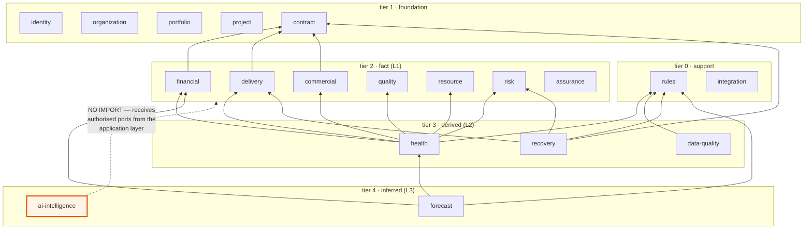

# Module map — contexts, contracts, and prohibited dependencies

**DEMO — SYNTHETIC DATA** · Phase 1 · Governed by ADR-0001 §4.1, ADR-0004 §2

Everything in this document is **machine-readable and enforced**. The authority is
[`architecture/manifest.json`](../../architecture/manifest.json); this file explains it. If the two
disagree, the manifest is what the build believes, and the disagreement is a defect.

---

## 1. The public surface convention

Each context and each platform module is a directory with exactly one entry point:

```
src/contexts/<context>/index.ts     ← the published contract: types + service interfaces
src/contexts/<context>/…            ← internal; unreachable from outside
```

Legal: `import type { HealthAssessment } from '@contexts/health';`
Illegal: `import { scoreDimension } from '@contexts/health/internal/scoring';` → **ARCH-002**

The alias form is the only cross-unit form. A relative import that tunnels sideways
(`../financial/internal/eac`) resolves to the same violation — the analyzer resolves the path before
judging it, so the rule cannot be evaded by spelling.

---

## 2. Dependency tiers

Tiers exist so "downward only" is decidable by a program rather than by argument.

| Tier | Meaning | Contexts |
| --- | --- | --- |
| **0** | Support — depended upon, depends on nothing | `rules`, `integration` |
| **1** | Foundation identity and structure | `identity`, `organization`, `portfolio`, `project`, `contract` |
| **2** | Domain facts (L1), some first-order derivation | `financial`, `delivery`, `commercial`, `quality`, `resource`, `risk`, `assurance` |
| **3** | Deterministic derived (L2) | `health`, `data-quality`, `recovery` |
| **4** | Inferred (L3) | `forecast`, `ai-intelligence` |

**A dependency may never point to a higher tier.** That is ADR-0004 §2's "a fact does not know its
own score", made checkable. The manifest self-check (`ARCH-009`) means the allow-lists cannot
themselves encode an inversion, so the rule cannot be weakened by editing the data it is enforced
from without that edit being visible.

### 2.1 Tiers are not epistemic layers

These are two different axes and Phase 1 found them conflated (see **CONFLICT C-2**):

- **Epistemic layer** (L1/L2/L3) is a property of a *value* — what kind of claim it is.
- **Tier** is a property of a *module* — what it is allowed to import.

`forecast` sits at tier 4 and emits L3. `financial` sits at tier 2 and emits both L1 and L2 —
`MET-FIN-001` is a recorded fact, `MET-FIN-014` is computed from it. A module does not have a layer;
its outputs do, and each output declares its own in its provenance envelope. Proposed as **ADR-0011**.

---

## 3. Module dependency diagram



Arrows point from dependant to dependency; the graph is acyclic and every arrow points downward.
`portfolio`, `data-quality` and `ai-intelligence` have deliberately thin or empty out-edges — see §5.

---

## 4. Context responsibilities and prohibitions

| Context | Owns | Tier | Emits | May import | **Must never** |
| --- | --- | --- | --- | --- | --- |
| `identity` | Users, roles, sessions, grants | 1 | L1 | — | Contain authorization *logic* — it records grants, it does not decide |
| `organization` | Entities, business units, geographies, hierarchy | 1 | L1 | — | Know about projects |
| `portfolio` | Grouping and rollup membership | 1 | L1 | — | Import `financial`, `health` or `forecast` to fetch aggregation inputs |
| `project` | Project identity, lifecycle, engagement model | 1 | L1 | — | Hold economics or status |
| `contract` | As-Sold, executed changes, pending changes, terms | 1 | L1 | — | Permit an As-Sold update; let a pending change flip status in place |
| `financial` | Actuals, revenue, cost, ETC/EAC, margin, FX | 2 | L1, L2 | `contract` | State a variance without naming its baseline; use float |
| `delivery` | Milestones, scope, schedule, progress, EVM | 2 | L1, L2 | `contract` | Own quality signals |
| `commercial` | Rates, pricing, invoicing, receivables | 2 | L1 | `contract` | Merge unsecured upside into forecast revenue |
| `quality` | Defects, escapes, coverage, rework | 2 | L1 | — | Score itself |
| `resource` | Assignments, utilisation, pyramid, attrition | 2 | L1 | — | Return individual-level data from an aggregate call |
| `risk` | Register, exposure, proximity, mitigation, interventions | 2 | L1, L2 | — | Compute health |
| `assurance` | Reviews, findings, evidence retention | 2 | L1 | — | Write to the audit log (it reads it) |
| `rules` | Versioned rule definitions, thresholds, weights, explanations | 0 | — | **nothing** | Import any context |
| `integration` | Adapter seams and ingestion contracts | 0 | — | **nothing** | Import a consumer of the data it stages |
| `health` | Composite scoring, RAG, divergence, contributions | 3 | L2 | `rules` + six fact domains | Blend confidence into the score; run in the UI |
| `data-quality` | Completeness, freshness, consistency, confidence | 3 | L2 | `rules` | Import fact contexts; multiply confidence by health |
| `recovery` | Recovery plans, baselines, intervention outcomes | 3 | L1, L2 | `rules`, `contract`, `delivery`, `risk` | Restate the As-Sold baseline |
| `forecast` | Trajectory, deterioration, projected outturn | 4 | **L3** | `rules`, `health`, `financial` | Present an inference with the authority of a computed figure |
| `ai-intelligence` | Retrieval, grounding, narration, citations | 4 | L3 | **nothing** | Import any domain context; emit a numeral in a fact position |

### 4.1 The prohibitions that are enforced rather than documented

| # | Prohibition | Code | Authority |
| --- | --- | --- | --- |
| 1 | Upward layer dependency (Domain → Application → Presentation) | `ARCH-001` | §4.1 rules 1, 6 |
| 2 | Import past a public surface | `ARCH-002` | §4.1 rule 2 |
| 3 | Undeclared or tier-inverting context dependency | `ARCH-003` | §4.1 rule 3 |
| 4 | `ai-intelligence` importing any domain context | `ARCH-004` | §4.1 rule 4, ADR-0004 §3 |
| 5 | `rules` importing anything but platform | `ARCH-005` | §4.1 rule 5 |
| 6 | External package outside its permitted layer (incl. `decimal.js`) | `ARCH-006` | ADR-0001 §7, ADR-0002 §1 |
| 7 | Any cycle, at file or module level | `ARCH-007` | §4.1 rule 7 |
| 8 | Ambient clock / float coercion / colour literal | `ARCH-008` | ADR-0003 §5, ADR-0002, REQ-UX-001 |
| 9 | A declared allow-list that inverts a tier | `ARCH-009` | §4.1 rule 3 |
| 10 | A declared unit with no public surface | `ARCH-010` | ADR-0001 §4 |
| 11 | Undeclared platform module dependency | `ARCH-011` | ADR-0001 §5 |
| 12 | Cross-context foreign key or join | *not yet enforced* | ADR-0001 §3 — **Phase 2**, once a schema exists |

Item 12 is the one gap and it is recorded as debt **DR-007** rather than left implied.

---

## 5. Ports-in orchestration — three contexts that invert their dependencies

Three contexts would, if built naively, need dependencies the rules forbid. Rather than weaken a
rule, each declares a **port** in its public surface and the Application layer supplies an
implementation. Proposed as **ADR-0012**.

| Context | Naive dependency | Why it is forbidden | Port |
| --- | --- | --- | --- |
| `portfolio` | `financial`, `health`, `forecast` | tier 1 → tiers 2/3/4 | `PortfolioAggregationInput[]` supplied by the orchestrator, already filtered to the caller's authorised set |
| `data-quality` | eleven fact contexts | Not forbidden by tier, but an eleven-context import surface makes adding a fact domain a change to this context | `DataQualityProbe` implemented by each fact context, registered by the orchestrator |
| `ai-intelligence` | the Application layer | Upward dependency (rule 1); direct context import (rule 4) | `AuthorisedRetrievalPort` bound to the caller's `AuthorizationContext` before it is handed over |

The `portfolio` case is not a stylistic preference — it also satisfies ADR-0005 §5. Because the
inputs are supplied already scoped, a portfolio total *cannot* be computed globally and filtered
afterwards; there is no global set in reach. The architecture rule and the security rule turn out to
want the same shape, which is usually a sign the shape is right.

---

## 6. Platform module contracts

Platform holds no business logic. Each module is a contract that domain code depends on and that
Phase 2/5 implement against.

| Module | Contract | State after Phase 1 |
| --- | --- | --- |
| `decimal` | `Money` value object, `Ratio`/`NOT_COMPUTABLE`, currency, largest-remainder `allocate()` | **IMPLEMENTED**, 24 tests |
| `time` | `Clock`, `FixedClock`, `SystemClock`, branded `Instant`/`WeekId`/`CalendarDate` | **IMPLEMENTED**; period arithmetic `STUBBED` pending OQ-5 |
| `provenance` | `Provenance<T>` envelope, `observed`/`derived`/`inferred` constructors, `ValueReference` | **IMPLEMENTED**, 8 tests |
| `authz` | `AuthorizationContext`, `Role`, `FieldClassification`, `AuthorizationPolicy`, `AuthorisedEntitySet` | **STUBBED** — Phase 5 |
| `audit` | `AuditRecord` (verbatim from `SECURITY_MODEL.md` §5.2), `AuditSink`, `AuditReader` | **STUBBED** — Phase 5 |
| `persistence` | `UnitOfWork`, `Repository`, `ImmutableStore`, `AppendOnlyStore`, `Migration` | **STUBBED** — Phase 2 |
| `config` | Typed, externalised configuration; demo marker constant | **IMPLEMENTED**, 5 tests |

Two contracts encode a governance rule in their *shape* rather than in a comment:

- **`ImmutableStore` offers no update path.** ADR-0003's anti-laundering control is a database
  privilege, but a type that cannot express the mutation makes the accidental version impossible
  and the deliberate version obvious.
- **`AppendOnlyStore` exposes `seriesAsOf` and `seriesAsCorrected` as separate methods.** "What did
  we believe on 2026-04-15?" and "what do we now believe was true then?" are different questions
  (ADR-0003 §3), and a single method with a boolean flag would let a caller confuse them.
