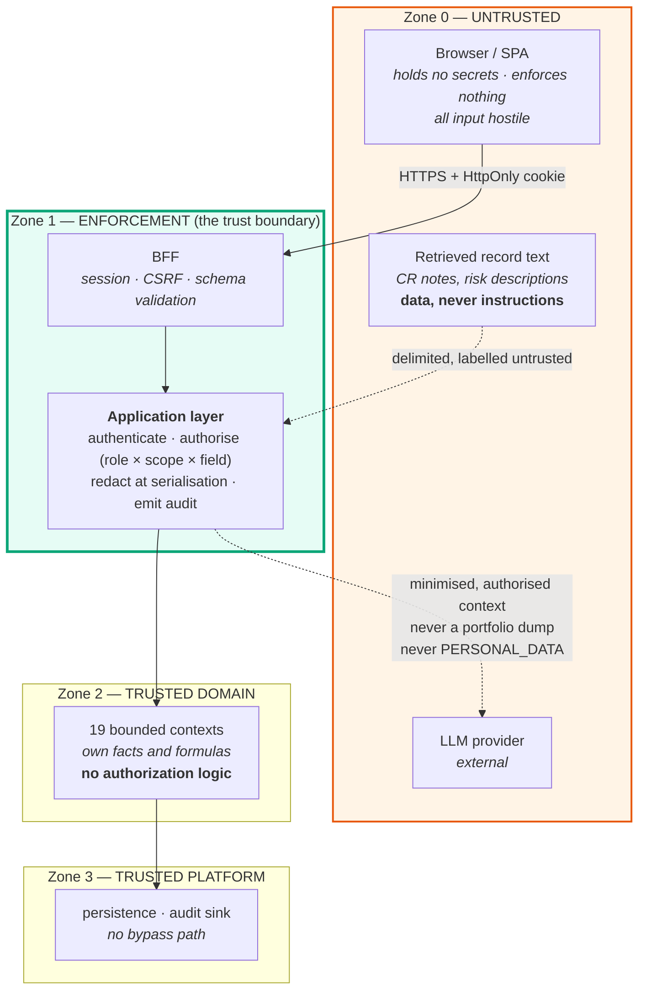

# Security architecture — trust zones and enforcement points

**DEMO — SYNTHETIC DATA** · Phase 1 · Governed by ADR-0005 and `SECURITY_MODEL.md`

`SECURITY_MODEL.md` is authoritative for anything about identity, access, exposure or audit, and it
outranks this file and the code. This document adds only the *architectural* view: where the trust
zones sit, where enforcement physically happens, and which structural properties Phase 1 has already
made true. Detailed implementation is Phase 5.

---

## 1. Trust zones



**There is exactly one crossing from Zone 0 to Zone 2, and it goes through Zone 1.** That is the
whole design. `SECURITY_MODEL.md` §2 B6: no debug endpoint, no admin console, no "internal" route
that skips it.

---

## 2. Enforcement points

| Point | Enforces | Where | Phase |
| --- | --- | --- | --- |
| Session validation | Authentication, expiry, revocation | BFF → Application | 5 |
| Capability check | Role × capability (`SECURITY_MODEL.md` §4.4) | Application, per use case | 5 |
| Scope resolution | Organisational scope → concrete entity set | Application, **before any query** | 5 |
| Aggregate computation | Totals over the authorised set only | Application orchestrator | 5, 7 |
| Field redaction | Classification → permission; unauthorised fields **absent** | Application, at serialisation | 5 |
| Audit emission | Sensitive reads, all writes, all denials | Application, same transaction as writes | 5 |
| Assistant retrieval | Inherits caller context; no privileged path | Application binds the port | 11 |

Every row is the Application layer. That is not a coincidence — it is ADR-0005 §1, and it is why
domain contexts contain no authorization logic at all: "authorization in two places is authorization
in neither; it drifts, and it drifts open."

---

## 3. Data classification zones

| Classification | Examples | Crosses to browser | Crosses to LLM | Read audited |
| --- | --- | --- | --- | --- |
| `PUBLIC_INTERNAL` | Project name, dates, RAG | If in scope | Yes, minimised | No |
| `DELIVERY_SENSITIVE` | Milestones, defects, effort, risks | If in scope + permitted | Yes, minimised | No |
| `COMMERCIAL_CONFIDENTIAL` | Cost, rates, margin, contract value, VaR | Only with the permission | **Values never in bulk** | **Yes** |
| `PERSONAL_DATA` | Named individual utilisation, attrition | Aggregate by default | **Never** | **Yes** |

The read-auditing of commercial data is unusual, deliberate, and flagged for CISO confirmation as
decision **D-4** (`PHASE_HANDOFF.md` §1.4). Its justification is in `SECURITY_MODEL.md` §1: the most
damaging realistic breach is not a database dump but a legitimate-looking query returning margin data
for accounts outside the requester's remit — "because that happens quietly, looks like normal use,
and leaves no trace unless reads are audited."

---

## 4. The audit boundary

```
Application layer ──▶ AuditSink (platform contract) ──▶ audit schema
                                                        │
                                                        ├─ application role: INSERT only
                                                        ├─ no UPDATE, no DELETE grant
                                                        └─ read: ASSURANCE_AUDITOR only,
                                                           and that read is itself audited
```

Three architectural properties:

1. **The sink is a platform contract**, so no domain context can write an audit record directly and
   no context can skip one by writing to persistence itself.
2. **Audit writes share the transaction with the audited write.** A failure to audit fails the
   operation — availability is subordinate to defensibility here, deliberately.
3. **Append-only is a database privilege**, not an application convention. `ImmutableStore` in
   `src/platform/persistence` offers no update method, which makes the accidental version impossible;
   the revoked grant makes the deliberate version impossible too.

---

## 5. The AI retrieval boundary

The assistant is "the most efficient exfiltration tool ever attached to a data set, if authorization
is not enforced beneath it" (`SECURITY_MODEL.md` §6). Three walls, in order of load-bearing:

1. **No data path.** `ai-intelligence` cannot import any domain context — enforced as `ARCH-004`,
   with seven negative tests. It receives an `AuthorisedRetrievalPort` already bound to the caller.
   There is nothing to escape *to*.
2. **Scope resolved before the model runs.** A fully successful prompt injection cannot widen
   retrieval, because retrieval was bound before the model saw a token.
3. **No numerals.** `ValueReference` has no `value` field; the model emits references that
   presentation resolves against domain-computed values. A wrong number is not expressible.

Prompt hardening sits on top of these as defence in depth. It is not the defence.

---

## 6. What Phase 1 has already made structurally true

Phase 5 implements the controls; these properties exist now and are tested:

| Property | Mechanism | Evidence |
| --- | --- | --- |
| A domain context cannot import the Application layer | Layer rule | `ARCH-001`, 7 tests |
| `ai-intelligence` cannot reach any domain context | Context rule | `ARCH-004`, 7 tests |
| The presentation layer can import only `@app` | Layer rule + public surface | `ARCH-001`/`ARCH-002`, 4 tests |
| No source file can reach `data/` or a seed file directly | Escape rule | `ARCH-001`, 1 test |
| `AuthorizationContext` exists only as a platform type the Application layer constructs | Module placement | `src/platform/authz` |
| The audit record shape matches `SECURITY_MODEL.md` §5.2 field for field | Contract | `src/platform/audit` |
| An L3 value cannot exist without citable evidence | Constructor precondition | 2 tests |
| No secret material in the repository | CI gate | `scripts/ci/secret-scan.mjs`, 99 files scanned |

None of this is authorization *working* — Phase 5 does that. It is authorization being *possible to
enforce in one place*, which is the property an architecture can provide and a later phase cannot
retrofit.
